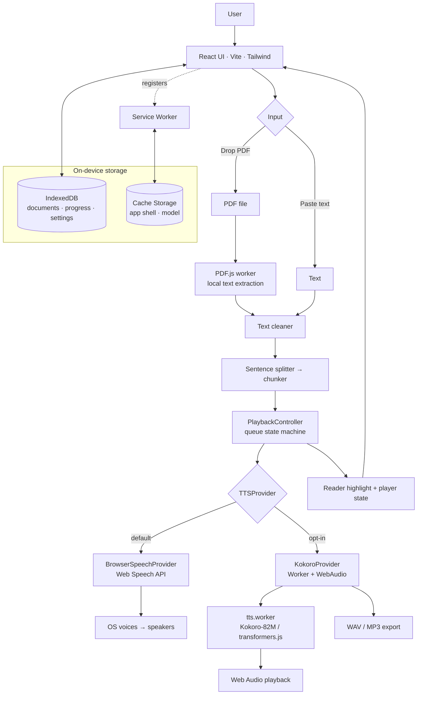
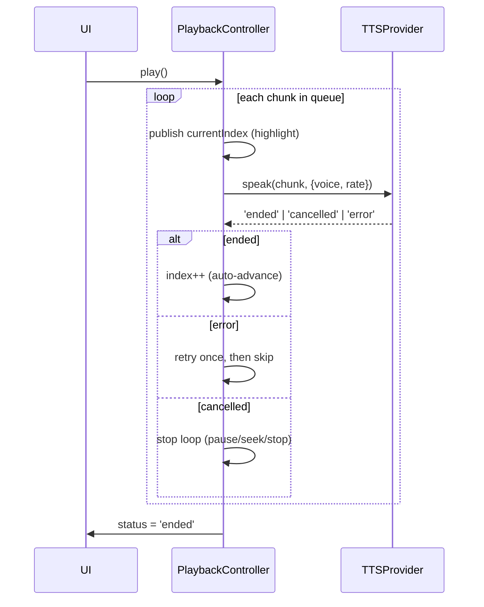

# Architecture

Local Reader is a **100% client-side** React app. There is no backend, no database
server, no API key, and no cloud AI. Every document is processed in the browser and
never leaves the device. This document explains how it fits together.

---

## 1. System overview



The only network use is **optional**: on first use of the neural engine, the Kokoro
model is fetched from a public CDN and then cached. The default browser engine needs
no network at all.

---

## 2. Component / module architecture

```
src/
├── app/App.tsx                 # shell: landing ↔ reader, header, settings
├── components/
│   ├── common/                 # IconButton, Drawer, ErrorBoundary
│   ├── upload/                 # TextInput, FileDrop
│   ├── reader/                 # ReaderView (highlight), ReaderScreen
│   ├── player/                 # PlayerBar, SpeedControl, VoicePicker, ExportButton
│   ├── documents/              # RecentDocuments
│   └── settings/               # SettingsPanel
├── features/
│   ├── documents/              # persistence, last-doc pointer
│   ├── playback/               # PlaybackController (framework-free state machine)
│   └── settings/               # theme, wipe-all-data
├── services/
│   ├── pdf/pdfService.ts       # PDF.js extraction
│   ├── tts/                    # TTSProvider + Browser/Kokoro impls + registry
│   ├── audio/                  # wav, mp3, exporter
│   └── storage/db.ts           # IndexedDB wrapper (idb)
├── workers/tts.worker.ts       # Kokoro inference off main thread
├── hooks/                      # usePlayback, useVoices, useKokoroStatus, …
├── store/                      # zustand: settings, documents
└── utils/                      # textClean, sentenceSplit, chunker, pdfText, time, lang
```

**Key boundary:** the UI and `PlaybackController` depend only on the `TTSProvider`
interface — never on `speechSynthesis` or any model runtime directly. New engines can
be added by implementing the interface and registering them in `services/tts/index.ts`.

---

## 3. TTS pipeline



- **Chunking** keeps whole sentences together, staying under a ~240-char safe limit
  (well below the Web Speech ~15s/short-utterance stall). Over-long sentences split at
  clause/word boundaries, never mid-word.
- **BrowserSpeechProvider** uses `SpeechSynthesisUtterance`, async voice loading, a
  keep-alive that nudges `resume()` to dodge Chromium's long-utterance stall, and maps
  cancel/interrupt to a clean `'cancelled'` outcome.
- **KokoroProvider** posts each chunk to `tts.worker`, receives a Float32 PCM buffer,
  and plays it via the Web Audio API (pause/resume = `AudioContext.suspend/resume`).
- **Highlighting** is per chunk (sentence/paragraph level) — honest to what the engine
  actually reads. We do not fake word-level sync (Web Speech `charIndex` is unreliable).

---

## 4. PDF pipeline

```mermaid
flowchart LR
  F[PDF file] --> V[validate type/size]
  V --> L[PDF.js getDocument\n(own worker)]
  L --> P[for each page:\ngetTextContent]
  P --> G[group items into lines\nby geometry]
  G --> PAR[paragraphs via\nvertical-gap detection]
  PAR --> HF[strip repeating\nheaders/footers + page #s]
  HF --> C[cleanText\nhyphenation, whitespace]
  C --> DOC[readable document]
  P -. no text on any page .-> OCR[Scanned → OCR-required message]
```

Extraction runs page-by-page and yields to the event loop so the UI stays responsive
on large PDFs. PDF.js does the heavy parsing in its own worker.

---

## 5. Storage & offline

```mermaid
flowchart TD
  subgraph IndexedDB
    D[documents]
    PR[progress]
    S[settings]
  end
  subgraph CacheStorage
    SHELL[app shell: JS/CSS/icons/PDF worker]
    MODEL[Kokoro model + ORT wasm\n(runtime, best-effort)]
  end
  APP[App] --> D
  APP --> PR
  APP --> S
  APP -->|localStorage| THEME[theme + last-doc pointer]
  SW[Service Worker\nWorkbox] --> SHELL
```

- **IndexedDB** (`idb`): documents, reading progress, settings.
- **localStorage**: theme (applied pre-paint, flash-free) and the last-opened-doc pointer.
- **Service Worker** (vite-plugin-pwa / Workbox): precaches the app shell + PDF worker,
  so the browser-engine experience works fully offline after first load.
- **Clear all data** wipes IndexedDB + Cache Storage + the local pointers.

Offline matrix:

| Capability | Offline after first load? |
|---|---|
| App shell, paste text, PDF extraction, browser-voice TTS | ✅ Yes (precached) |
| Kokoro neural voice + audio export | ⚠️ After first model download; model/wasm cached best-effort |

---

## 6. Technology decisions

| Decision | Why |
|---|---|
| **Vite + React + TS** (no Next.js) | Purely client-side; no server rendering needed. Fast, static output. |
| **Web Speech API as default engine** | Zero download, instant, works offline immediately. |
| **Kokoro-82M as opt-in engine** | Far higher quality + the only path that can export audio. Apache-2.0. |
| **`TTSProvider` interface** | Decouples UI from engines; future engines (Piper, etc.) drop in. |
| **PDF.js** | Mature, Mozilla-maintained, fully local extraction. |
| **IndexedDB via `idb`** | Right tool for structured local data; no server DB. |
| **Kokoro in a Web Worker** | Keeps inference off the UI thread; isolates the large dependency into a lazy chunk. |
| **Model from CDN, cached** | Keeps the deploy static and within free hosting bandwidth. |
| **Zustand** | Minimal global state without Redux boilerplate. |

---

## 7. Extensibility

The architecture leaves room for: EPUB/DOCX/TXT import (new parsers → same cleaner →
chunker), more TTS engines (implement `TTSProvider`), a desktop wrapper (Tauri) reusing
the same UI, bookmarks/notes (new IndexedDB stores), and translation/summarization
(local models in the worker). None require a backend.
